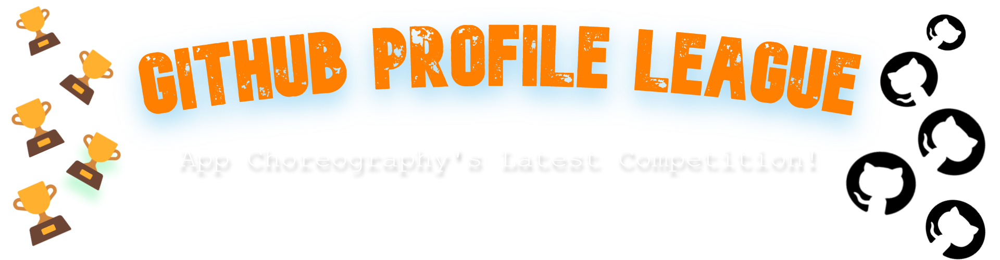

###### Join our org [Here ✉️](https://github.com/App-Choreography/Get-An-Invite/issues/new?assignees=CodingSpecies&labels=Organisation+Invite%21+%F0%9F%93%A8&template=please-can-i-join-this-organisation------.md&title=Please+Can+I+Join+This+Organisation%3F+%F0%9F%A5%BA%F0%9F%99%8F") | [Our Website 🌐](https://app-choreography.github.io/) | [Repositories 📚](https://github.com/orgs/App-Choreography/repositories)

## 🏆 Current Winner 🏆: `_______________` . 

> ##### Will be regularly updated.

## What is *GitHub Profile League* ?
👉 Do you want to have the best GitHub profile README?

👉 Do you want to vote for others profile READMEs?

👉 Do you wish to fill in the green squares on your profile, but also have some competition fun?

This is where we can see some of GitHub's 💫BEST💫 profile READMEs and vote for others! 

- There will be **3** league tables.
- There will be **9** contestants at a time.
   

## Press [👉 here 👈](./EnterProfile.md) to see how to add your README profile.
## Press [👉 here 👈](./HowToVote.md) to see how you can vote for others!

# Leagues:

## League 1 🥇:

| [JayantGoel001](https://github.com/JayantGoel001): `🏅 0` | Insert Name 2: `🏅 0`| [CodingSpecies](https://github.com/CodingSpecies): `🏅 1`|
| -------- | -------- | -------- |
|  | Profile Screenshot 2 |  |

## League 2 🥈:

| Insert Name 4: `🏅 0`| Insert Name 5: `🏅 0` | Insert Name 6: `🏅 0`|
| -------- | -------- | -------- |
| Profile Screenshot 4 | Profile Screenshot 5 | Profile Screenshot 6 |

## League 3 🥉:

| Insert Name 7: `🏅 0` | Insert Name 8: `🏅 0` | Insert Name 9: `🏅 0` |
| -------- | -------- | -------- |
| Profile Screenshot 7 | Profile Screenshot 8 | Profile Screenshot 9 |

## 🎯 How does the League grouping work and how will the winner be determined?

- Once all leagues are full, the 48 hour countdown will begin. This means there will be 48 hours for people to vote.
- After the time period, App-Choreographers will come and re-order the profiles depending on the amount of votes given.
- This will be repeated 5 times. After 10 days, there will be a clear winner!
- First come, first serve! Those who contribute first and add their profiles will be added in ascending order, meaning that the first contributor will be the frst name in League 1, and the last contributor will be the last name in League 3.

## The Winner 🏆:
Once the winner is determined this is what they get:

- A professional and personalised digital banner, which you can customize once you win showing you have the best GitHub profile README.
- Their name and GitHub link will be added to App-Choreo's website.
- The owner of this organisation CodingSpecies, will add the link of the winners profile to their own profile README.
- A certificate.
- Other prizes are still to be considered.
